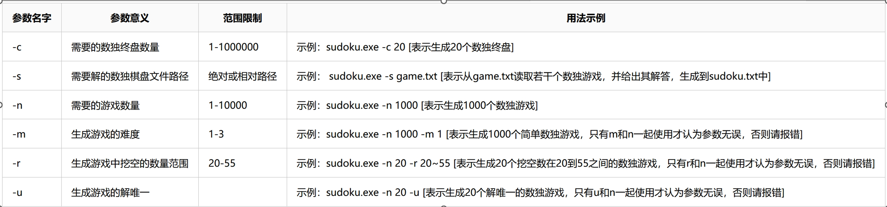

# Sudoku

## 描述:

就是一个用来生成数独相关的小玩意。

## 安装前准备环境:

操作系统: Windows 10

编译器: g++(mingw64,version:12.2.0-rev2,thread model:win32)

## 安装:

跳转到本目录下，打开命令行窗口并输入指令
> make

这将在目录`.\release\bin\`生成`sudoku.exe`

## Sudoku.exe的使用

获取帮助: 
> sudoku.exe -h

注：由于使用了getopt函数，选项与参数间的空格应删去

## 质量分析与覆盖测试

将置于`test`分支下的`.\testresult\`中

也可以通过以下指令手动测试：
> make unittest